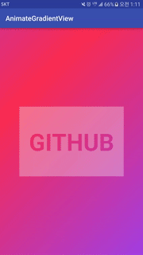
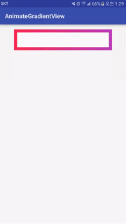

[](http://developer.android.com/index.html)
[](https://android-arsenal.com/api?level=11)
[](http://opensource.org/licenses/MIT)

# AnimateGradientView

AnimateGradientView is android library to make gredient flow or rotate infinitely

 


## Setup Gradle

```groovy
dependencies {
    ...
    compile 'kr.pe.burt.android.lib:animategredientview:0.0.1'
}
```

## Attributes

AnimateGradientView provides a few attributes for animating gradient.

* agv_angle
	* is rotation degree of the gradient
	* is flat value
	* from 0 to 360
* agv_startColor
	* is start color of the gradient
	* is color value ( #RRGGBB )
* agv_endColor
	* is end color of the gradient
	* is color value ( #RRGGBB )
* agv_middleColor
	* is middle color of the gradient
	* is color value ( #RRGGBB )
* agv_alpha
	* is alpha value of the gradient
	* is float value
	* from 0.0 to 1.0
* agv_startOffset
	* is offset of start color
	* is float value
	* from 0.0 to 1.0
* agv_middleOffset
	* is offset of middle color
	* is float value
	* from 0.0 to 1.0
* agv_endOffset
	* is offset of end color
	* is float value
	* from 0.0 to 1.0
* agv_gradient_scale
	* is scale factor of the gradient
	* is float value
* agv_autostart
	* true or false
* agv_duration
	* is friction value to animation
* agv_animation
	* rotation or flow
* agv_flow_direction
	* left, right, top or bottom 

## Examples

### Flow Animation 
```xml
<kr.pe.burt.android.lib.animategradientview.AnimateGradientView
        android:id="@+id/agv"
        android:layout_width="match_parent"
        android:layout_height="match_parent"
        android:layout_centerInParent="true"
        agv:agv_startColor="#FF2D55"
        agv:agv_endColor="#A542EA"
        agv:agv_alpha="1.0"
        agv:agv_gradient_scale="1.4"
        agv:agv_animation="flow"
        agv:agv_angle="45"
        agv:agv_duration="1000"
        />
```

### Rotate Animation

```xml
<kr.pe.burt.android.lib.animategradientview.AnimateGradientView
        android:id="@+id/agv"
        android:layout_width="320dp"
        android:layout_height="68dp"
        android:layout_alignParentTop="true"
        android:layout_centerHorizontal="true"
        agv:agv_startColor="#FF2D55"
        agv:agv_endColor="#A542EA"
        agv:agv_alpha="1.0"
        agv:agv_gradient_scale="1.4"
        agv:agv_animation="rotation"
        agv:agv_duration="2000"
        agv:agv_autostart="false"
        />
```


## MIT License

The MIT License (MIT)

Copyright (c) 2016 Sungcheol Kim, [https://github.com/skyfe79/AnimateGradientView](https://github.com/skyfe79/AnimateGradientView)

Permission is hereby granted, free of charge, to any person obtaining a copy
of this software and associated documentation files (the "Software"), to deal
in the Software without restriction, including without limitation the rights
to use, copy, modify, merge, publish, distribute, sublicense, and/or sell
copies of the Software, and to permit persons to whom the Software is
furnished to do so, subject to the following conditions:

The above copyright notice and this permission notice shall be included in all
copies or substantial portions of the Software.

THE SOFTWARE IS PROVIDED "AS IS", WITHOUT WARRANTY OF ANY KIND, EXPRESS OR
IMPLIED, INCLUDING BUT NOT LIMITED TO THE WARRANTIES OF MERCHANTABILITY,
FITNESS FOR A PARTICULAR PURPOSE AND NONINFRINGEMENT. IN NO EVENT SHALL THE
AUTHORS OR COPYRIGHT HOLDERS BE LIABLE FOR ANY CLAIM, DAMAGES OR OTHER
LIABILITY, WHETHER IN AN ACTION OF CONTRACT, TORT OR OTHERWISE, ARISING FROM,
OUT OF OR IN CONNECTION WITH THE SOFTWARE OR THE USE OR OTHER DEALINGS IN THE
SOFTWARE.